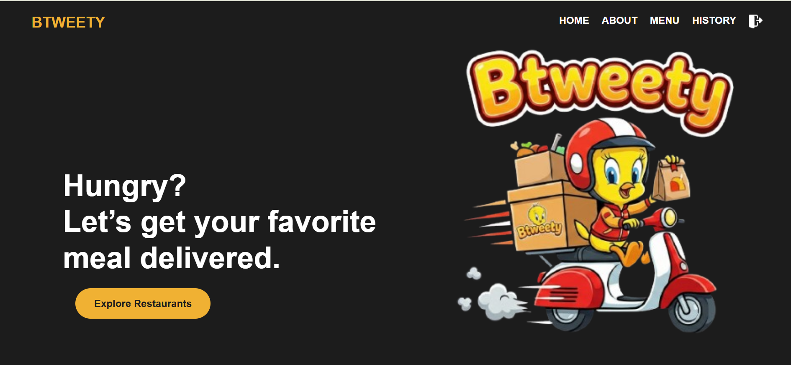

# 🍕 Btweety - Food Ordering System

A modern, full-stack food ordering application built with Node.js, Express, and SQL Server database . This system allows users to browse restaurants, place orders, and manage their deliveries seamlessly.



## ✨ Features

- **User Authentication & Authorization**: Secure login and registration system
- **Restaurant Browsing**: Browse available restaurants and their menus
- **Order Management**: Place, track, and manage food orders
- **Shopping Cart**: Add items to cart with quantity management
- **Order History**: View past orders and reorder favorite items
- **Admin Dashboard**: Manage restaurants
- **restaurants Dashboard**: Manage menus, and orders
- **Real-time Updates**: Track order status in real-time
- **Responsive Design**: Mobile-friendly web interface

## 🛠 Tech Stack

### Backend
- **Runtime**: Node.js
- **Framework**: Express.js
- **Database**: SQL Server database
- **Authentication**: Session-based & JWT

### Frontend
- **HTML5**: Semantic markup
- **CSS3**: Responsive styling
- **JavaScript**: Client-side interactivity
- **EJS**: Template engine for dynamic views

### Tools & Libraries
- **Express Middleware**: Body parser, session management
- **File Upload**: Multer for image uploads
- **Database**:  SQL Server database created and managed using SQL Server Management Studio (SSMS).

## 📁 Project Structure

```bash
Btweety/
├── .vscode/                 # VS Code configuration
├── assets/                  # Static assets (images, styles, etc.)
├── controllers/             # Application logic & controllers
├── database/                # Database-related files
├── db queries/              # SQL scripts and queries
├── demo video/              # Demo video files
├── models/                  # Data models
├── uploads/                 # Uploaded images
├── views/                   # EJS templates (UI)
├── .env                     # Environment variables
├── server.js                # Main server entry point
├── package.json             # Project dependencies
├── package-lock.json        # Dependency lock file
└── README.md                # Project documentation

```


# 👩‍💻 Author

## Jana Hany


